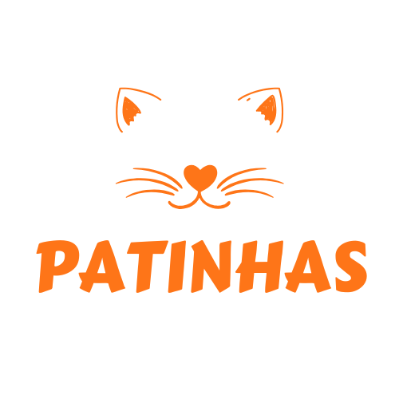

# Patinhas - Site de Adoção de Animais

## Descrição do Projeto

O **Patinhas** é um projeto desenvolvido por alunos da Universidade UNIFG com o objetivo de facilitar a adoção de animais abandonados. Através de uma plataforma intuitiva, o site conecta adotantes e ONGs, promovendo um ambiente seguro e acolhedor para a adoção responsável de pets.

## Funcionalidades

- **Perfil do Usuário**: Adotantes podem criar perfis, onde podem visualizar animais que estão interessados e acompanhar o status da adoção.
- **Busca de Animais**: Usuários podem buscar animais disponíveis por tipo, raça, idade e localização.
- **Solicitar Adoção**: Usuários podem solicitar adoção após a escolha de seu pet ideal.

## Tecnologias Utilizadas

- **Frontend**: HTML, CSS, JavaScript
- **Hospedagem**: Vercel

## Contato

Para mais informações, entre em contato com a equipe do projeto:

- **Nome do Responsável**: Nicholas Arruda
- **Email**: nicholasarruda99@gmail.com
- **LinkedIn**: [Nicholas Arruda](https://www.linkedin.com/in/dev-nicholas-arruda/)
